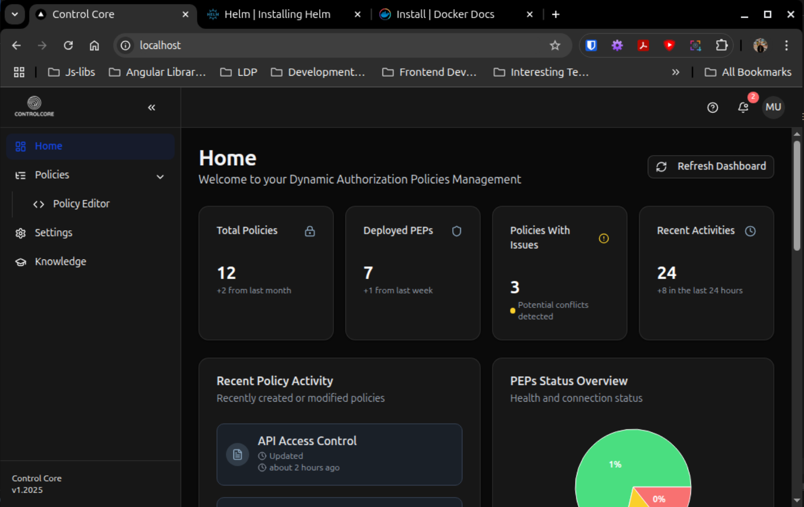
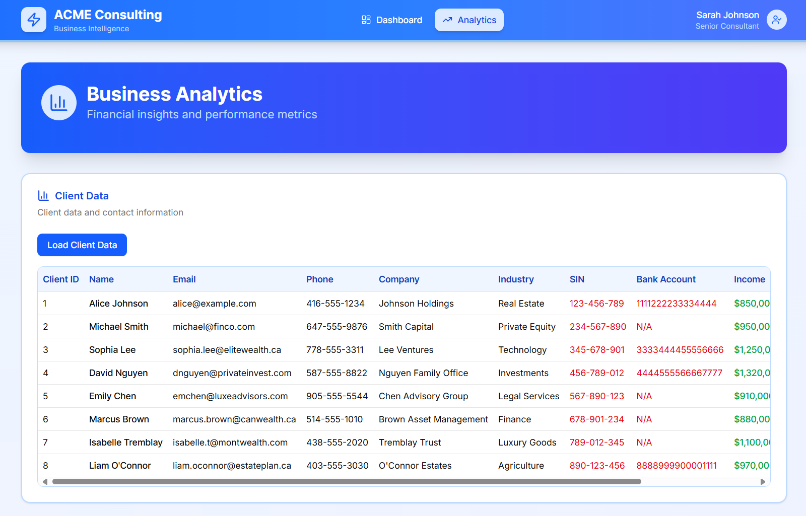

# cc-infra

Control Core Infrastructure and DevOps Management
This directory contains all infrastructure-related files for Control Core deployment and management. Control Core is the centralized authorization and compliance platform built for the AI-driven enterprise. It solves the core problem of securing the dynamic, real-time interactions between new AI initiatives and legacy technology. By enforcing business, security, and compliance rules with dynamic context management, Control Core eliminates the need for brittle, custom-coded access logic, turning a major security liability into a strategic advantage. It empowers organizations to innovate faster, reduce operational costs, and mitigate the risk of a breach.

## Directory Structure

- **`version-management/`** - Version management system and scripts
- **`docker-compose/`** - Docker Compose files for different deployment scenarios
- **`helm-chart/`** - Helm charts for Kubernetes deployment
- **`k8s/`** - Kubernetes YAML files and scripts
- **`docs/`** - Documentation and images
- **`customer-downloads/`** - Customer deployment packages
- **`deployment-guides/`** - Deployment documentation
- **`auto-scaling/`** - Auto-scaling configurations
- **`opal/`** - OPAL integration files
- **`opa/`** - OPA server management and configuration
- **`cedar/`** - Cedar Policy Store integration (Future)
- **`loadImagesIntoKind.sh`** - Scripts for loading images into Kind clusters

## Component Architecture

### Core Components

1. **cc-pap** - Policy Administration Point (Frontend UI)
2. **cc-pap-api** - Policy Administration Point API (Backend)
3. **cc-bouncer** - Policy Enforcement Point with integrated PDP
4. **cc-pap-pro-tenant** - Multi-tenant Control Plane for Pro customers

### Demo Components

1. **acme-consulting-demo-api** - Standalone demo application
2. **acme-consulting-demo-frontend** - Demo application UI

### Infrastructure Components

1. **cc-signup-service** - Customer onboarding service
2. **cc-infra** - Infrastructure management

## Architecture Overview

See [docs/architecture-overview.md](docs/architecture-overview.md) for detailed architecture documentation.

## Version Management

Control Core uses a quarterly release schedule with patch versions for bug fixes and security updates. See [version-management/README.md](version-management/README.md) for comprehensive version management documentation.

### Quick Version Management

```bash
# From project root

./version-manager.sh current
./version-manager.sh status
./version-manager.sh bump patch
# From cc-infra directory

cd cc-infra/version-management/scripts
./version-manager.sh current
./version-manager.sh status
./version-manager.sh bump patch
```

## Advanced Context Generation and Ingestion

Control Core's most advanced feature is its context generation and ingestion capabilities. See [docs/context-deployment-guide.md](docs/context-deployment-guide.md) for comprehensive deployment and configuration of context-aware policies.

### Key Context Features

- **Context-Aware Policy Templates** - Pre-built templates for AI agents, LLMs, and RAG systems
- **Real-time Context Ingestion** - Fetches context from multiple sources (APIs, databases, streams)
- **Advanced Security Policies** - Data masking, encryption, and access controls
- **Content Injection** - Modifies requests and responses based on context
- **Performance Optimization** - Caching and rate limiting for context sources

## Quick Start

### Docker Compose Deployment

```bash
# Development environment

cd docker-compose
docker-compose -f controlcore-compose.yml up -d
# Local development (moved from root)

docker-compose -f controlcore-dev-compose.yml up -d
# Production environment

docker-compose -f controlcore-prod-compose.yml up -d
```

### Kubernetes Deployment

See the [helm-chart/README.md](helm-chart/README.md) for Kubernetes deployment instructions.

### Local Deployment

#### Prerequisite

- Docker v28.2.2 or higher ([Install Docker](https://docs.docker.com/engine/install/))
- KinD v0.29.0 or higher ([Install KinD](https://kind.sigs.k8s.io/docs/user/quick-start/#installing-with-a-package-manager))
- Helm 3.18 or higher ([Install Helm](https://helm.sh/docs/intro/install/))
- kubectl ([Install kubectl](https://kubernetes.io/docs/tasks/tools/))

#### Download all and load images into kind cluster

```shell
# Load them into kind. This step assumes you already have aws cli configured with your credentials already set in ~/.aws/credentials

chmod +x ./loadImagesIntoKind.sh 
./loadImagesIntoKind.sh 
# for arm-64 architecture images use
# ./loadImagesIntoKind.sh <namespace> <architecture> 

./loadImagesIntoKind.sh kind arm64
```

#### Step-by-Step instructions to run controlcore helm charts locally

1. Set up kind cluster

    ```shell
    cat <<EOF | kind create cluster --config=-
    kind: Cluster
    apiVersion: kind.x-k8s.io/v1alpha4
    nodes:
    - role: control-plane
      extraPortMappings:
      - containerPort: 80
        hostPort: 80
        protocol: TCP
      - containerPort: 443
        hostPort: 443
        protocol: TCP
    EOF
    ```

2. Install ingress

    ```shell
    kubectl apply -f [ingress-nginx deployment](https://kind.sigs.k8s.io/examples/ingress/deploy-ingress-nginx.yaml)
    ```

    Now the Ingress is all setup. Wait until is ready to process requests running:

    ```shell
    kubectl wait --namespace ingress-nginx \
      --for=condition=ready pod \
      --selector=app.kubernetes.io/component=controller \
      --timeout=90s
    ```

3. [Optional] Login into ACR

   ```shell
   # Ensure you already ran `aws configure` and set you ACCESS_KEY_ID, SECRET and REGION.
   aws ecr get-login-password --region ca-central-1 | docker login --username AWS --password-stdin 061730756658.dkr.ecr.ca-central-1.amazonaws.com
   ```

4. [Optional] pull and load all the images into your kind cluster

   ```shell
   # Pull all the images from ECR (use tag `latest-arm64` for arm64 architecture)
   docker pull 061730756658.dkr.ecr.ca-central-1.amazonaws.com/controlcoreio/cc-frontend:latest
   docker pull 061730756658.dkr.ecr.ca-central-1.amazonaws.com/controlcoreio/policy-admin-server:latest
   docker pull 061730756658.dkr.ecr.ca-central-1.amazonaws.com/controlcoreio/cc-pap:latest
   docker pull 061730756658.dkr.ecr.ca-central-1.amazonaws.com/controlcoreio/cc-pap-api:latest
   docker pull 061730756658.dkr.ecr.ca-central-1.amazonaws.com/controlcoreio/cc-bouncer:latest
   docker pull permitio/opal-server:latest
   ```

5. [Optional] Load them into kind.

   ```shell
   chmod +x ./loadImagesIntoKind.sh 
   ./loadImagesIntoKind.sh
   
   # For arm64 architecture use
   ./loadImagesIntoKind.sh arm64
   ```

6. Update `githubToken` in

   ```shell
   vi helm-chart/controlcore/values.yaml
   ```

   and update the githubToken with your token.

   ```yml
   global:  
    githubToken: ""   
   ```

7. Helm install controlcore chart

    ```shell
    cd helm-chart
    helm upgrade --install controlcore ./controlcore
   
    # For arm64 architecture images use
    helm upgrade --install controlcore ./controlcore -f ./controlcore/values-arm64.yaml
   
    # Note - you can override with custom values as shown below
    helm upgrade --install controlcore ./controlcore -f ./controlcore/values-dev.yaml #Override values by creating a new file
    helm upgrade --install controlcore ./controlcore -f ./controlcore/values-qa.yaml #Override values by creating a new file
    ```

   To uninstall the controlcore

    ```shell
    helm uninstall controlcore
    ```

8. ensure all pods are up and running without any issues.

   ```shell
   kubectl get all 
   
   # Sample output
   ╰$ kubectl get all
   NAME                                          READY   STATUS    RESTARTS   AGE
   pod/cc-frontend-67d9c497bf-nbkkj              1/1     Running   0          125m
   pod/cc-bouncer-dd598f49b-r8h2f                 1/1     Running   0          125m
   pod/cc-policy-admin-api-5bdccb4d54-bq2wc      1/1     Running   0          18m
   pod/cc-policy-admin-client-7c598c7d8d-9xj9q   1/1     Running   0          125m
   pod/cc-policy-admin-server-57c6c75896-htbmr   1/1     Running   0          18m
   
   NAME                             TYPE        CLUSTER-IP      EXTERNAL-IP   PORT(S)             AGE
   service/cc-frontend              ClusterIP   10.96.171.76    <none>        7600/TCP            125m
   service/cc-pap                   ClusterIP   10.96.31.133    <none>        8082/TCP            125m
   service/cc-bouncer                ClusterIP   10.96.102.172   <none>        8081/TCP            125m
   service/cc-policy-admin-client   ClusterIP   10.96.59.85     <none>        8083/TCP,8181/TCP   125m
   service/cc-policy-admin-server   ClusterIP   10.96.55.16     <none>        7002/TCP            125m
   service/kubernetes               ClusterIP   10.96.0.1       <none>        443/TCP             3h9m
   
   NAME                                     READY   UP-TO-DATE   AVAILABLE   AGE
   deployment.apps/cc-frontend              1/1     1            1           125m
   deployment.apps/cc-bouncer                1/1     1            1           125m
   deployment.apps/cc-policy-admin-api      1/1     1            1           125m
   deployment.apps/cc-policy-admin-client   1/1     1            1           125m
   deployment.apps/cc-policy-admin-server   1/1     1            1           125m
   
   NAME                                                DESIRED   CURRENT   READY   AGE
   replicaset.apps/cc-frontend-67d9c497bf              1         1         1       125m
   replicaset.apps/cc-bouncer-dd598f49b                 1         1         1       125m
   replicaset.apps/cc-policy-admin-api-59bdc977f8      0         0         0       27m
   replicaset.apps/cc-policy-admin-api-5bdccb4d54      1         1         1       18m
   replicaset.apps/cc-policy-admin-api-64f78c7dbd      0         0         0       125m
   replicaset.apps/cc-policy-admin-api-688f786bbb      0         0         0       21m
   replicaset.apps/cc-policy-admin-client-7c598c7d8d   1         1         1       125m
   replicaset.apps/cc-policy-admin-server-57c6c75896   1         1         1       18m
   replicaset.apps/cc-policy-admin-server-7748ddc686   0         0         0       27m
   replicaset.apps/cc-policy-admin-server-86788ffc4b   0         0         0       125m
   ```

9. Open Browser and navigate to [http://localhost](http://localhost) and you should see the controlcore dashboard.
   

#### Step-by-Step instructions to run Demo App helm charts locally

1. [Optional] Login into ACR

   ```shell
   # Ensure you already ran `aws configure` and set you ACCESS_KEY_ID, SECRET and REGION.
   aws ecr get-login-password --region ca-central-1 | docker login --username AWS --password-stdin 061730756658.dkr.ecr.ca-central-1.amazonaws.com
   ```

2. [Optional] pull and load all the images into your kind cluster

    ```shell
    # Pull all the images from ECR (use tag `latest-arm64` for arm64 architecture) or load them using loadImagesIntoKind script
    docker pull 061730756658.dkr.ecr.ca-central-1.amazonaws.com/controlcoreio/acme-demo/frontend:latest
    docker pull 061730756658.dkr.ecr.ca-central-1.amazonaws.com/controlcoreio/acme-demo/backend-api:latest
    ```

3. [Optional] Load them into kind.

   ```shell
   chmod +x ./loadImagesIntoKind.sh 
   ./loadImagesIntoKind.sh
   
   # For arm64 architecture use
   # ./loadImagesIntoKind.sh <namespace> <architecture> 
   ./loadImagesIntoKind.sh kind arm64
   ```

4. Install helm (assuming you already have kind cluster setup)

   ```shell
   cd helm-chart
   helm dependency update ./acme-demo
   helm upgrade --install acme-demo ./acme-demo
   
   # For arm64 architecture images use
   helm upgrade --install acme-demo ./acme-demo -f ./controlcore/values-arm64.yaml
   ```

   To uninstall the acme-demo

   ```shell
   helm uninstall acme-dome
   ```

5. Open Browser and navigate to [http://localhost/acme-demo](http://localhost/acme-demo) and you should see the acme demo dashboard.
   
